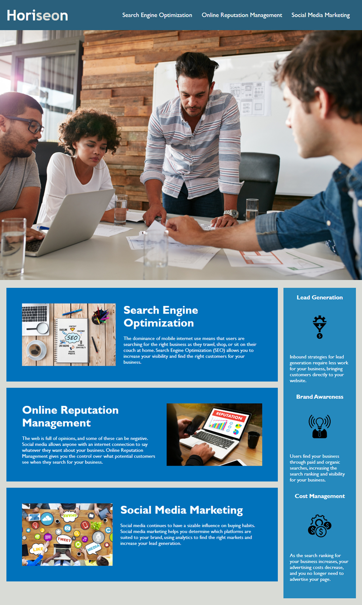

# Accessibility Updates for Horiseon Website

[Click here for access to updated Horiseon website](https://jamiethomason.github.io/challenge-1-horiseon/)

## Updates

1. Combined and organized CSS code.
2. Edited symantic HTML for functionality.
3. Added alt attributes to images for screen readers. 

## Website Preview

Below is an image of the website's appearance:

